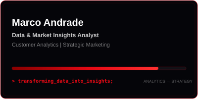
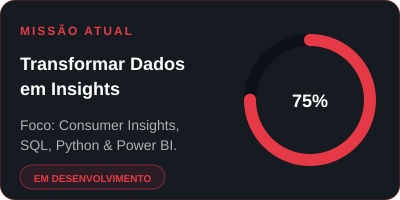

<table>
  <tr>
    <td align="center" width="50%">
      <!-- Card principal -->
      
    </td>
    <td align="center" width="50%">
      <!-- Missão atual -->
      
    </td>
  </tr>
</table>

 

### Consumer Insights • Analytics • Inteligência de Dados

Transformando **dados de comportamento em insights para decisões de negócio.**

## 👋 Sobre mim

Minha atuação é focada na **interseção entre inteligência de mercado, análise preditiva e inteligência de dados**. Combino técnicas avançadas de manipulação e modelagem estatística em ambiente Cloud com metodologias de pesquisa (quantitativas e qualitativas) para transformar dados brutos em decisões estratégicas de produto, experiência e negócios.

Passagem pelo ecossistema financeiro (**banco BV**) e corporativo (**Rumo**).

---

## 🛠️ Tech Stack & Ferramentas

### 🐍 Linguagens & Modelagem

### ☁️ Cloud & Big Data Infrastructure

### 📊 Business Intelligence & Automação low code

### 💡 Métodos & Competências
`Modelagem Preditiva (Regressão Logística)` • `Estatística Aplicada` • `Pesquisa Quantitativa (Surveys)` • `Governança de Dados` • `Customer Insights` • `Scrum/Agile`

---

## 🚀 O que eu entrego / Principais Casos de Uso

- **Estatística & Ciência de Dados:** Construção de modelos preditivos (ex: Regressão Logística) integrando variáveis de comportamento do consumidor com propensão/intenção de compra.
- **Engenharia de Consultas & Cloud:** Manipulação e consulta de grandes bases de dados no **GCP (BigQuery)** e **Databricks** via SQL para estruturação de datamarts e relatórios.
- **Visualização de Dados:** Construção de dashboards interativos no **Power BI** focados no acompanhamento de jornadas e KPIs de experiência e produto.

---

## 🏆 Destaques & Reconhecimento

- 🥈 **2º Lugar no Programa de Aceleração (banco BV):** Projeto focado no *Onboarding* do cliente, mapeamento de jornada de novos correntistas e proposição de melhorias baseadas em inteligência de dados e centralidade no usuário.

---

## 📌 Projetos em Destaque no GitHub

| Projeto | Descrição | Tecs Usadas |
| :--- | :--- | :--- |
| 📊 **[Inclusão Financeira de Jovens Periféricos ](https://github.com/MArcoAEAandrade/ic-inclusao-financeira)**, **[PPT_Programa_IC_2025](https://www.canva.com/design/DAHBxQ9n0uw/eSxy83wfE6jN6M7kYPgdNg/view?utm_content=DAHBxQ9n0uw&utm_campaign=designshare&utm_medium=link2&utm_source=uniquelinks&utlId=heb78ed7d22)**| Explorar dados secundários oficiais (PNADC, Relatórios Financeiros) para contextualizar barreiras de acesso ao sistema financeiro, com foco em juventude periférica. | `Python`, `SQL`, `Excel` |
| 📊 **[PPT_Diagnóstico Churn](https://canva.link/xifcba6630oaklr)**, **[Dashboard.py](http://localhost:8503/)**| Uma análise da carteira de clientes do banco,  revela: Quem são, como se comportam e por que os clientes decidem deixar o banco. |`Python`, `SQL`, `Cloud` |

## 📬 Vamos nos conectar?

---

 

*“Transformando dados em insights. Insights em impacto.”*

 

<!-- Snake Animation: Footer -->

 

